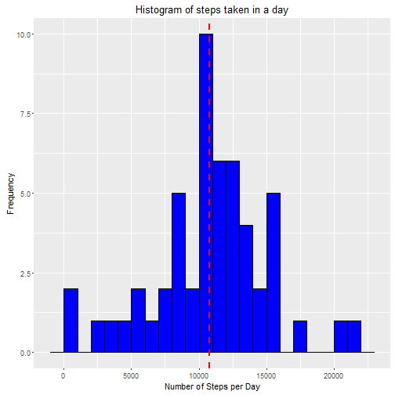
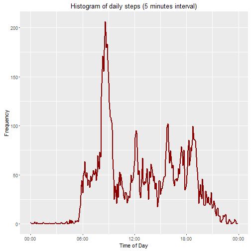
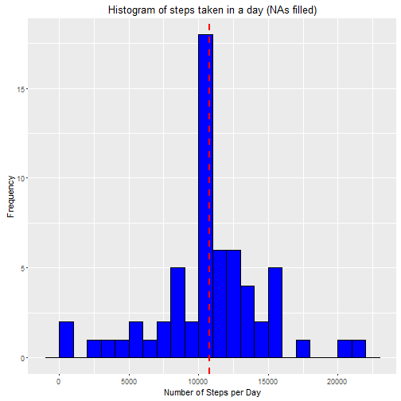
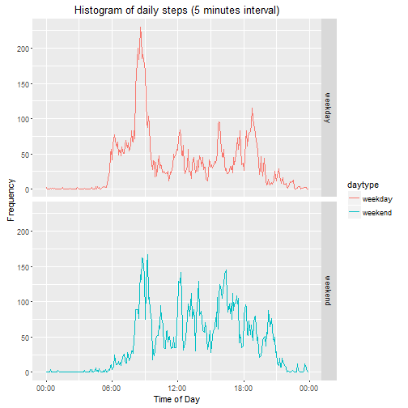

## Daily Activity Analysis

In this project we analyse a dataset consisting of two months (October and November, 2012) of data obtained from an anonymous individual using an activity monitoring device, which includes the number of steps taken in 5 minute intervals each day.

The project consists of multiple parts. Each part will be preceded by a short paragraph explaining what is to be done in that section.

## Load required libraries


```r
library(knitr)	
library(dplyr)
library(ggplot2)
library(scales)
```

## Section A: Loading and preprocessing the files

In this section we will:
1. Load the data (using read.csv()) and 
2. Transform the data into a  structure suitable for our analysis.

#### 1a. Download data source files (if not done yet).


```r
if (!file.exists("activity.csv"))  { 	
    download.file("https://d396qusza40orc.cloudfront.net/repdata/data/activity.zip",                    destfile="activity.zip")
    unzip("activity.zip")
}
```
	
#### 1b. Read data from the file


```r
activity <- read.csv("activity.csv", na.strings=c("NA"))	
```

#### 2. Perform required transformations on time related columns (date and interval).


```r
activity$date <- as.Date(activity$date)
activity$datetime <- as.POSIXct(strptime(sprintf("%9s %04d", activity$date, activity$interval), "%Y-%m-%d %H%M"))
activity$time <- as.POSIXct(strptime(sprintf("1970-01-01 %04d", activity$interval), "%Y-%m-%d %H%M"))
head(activity)
```

```
##   steps       date interval            datetime                time
## 1    NA 2012-10-01        0 2012-10-01 00:00:00 1970-01-01 00:00:00
## 2    NA 2012-10-01        5 2012-10-01 00:05:00 1970-01-01 00:05:00
## 3    NA 2012-10-01       10 2012-10-01 00:10:00 1970-01-01 00:10:00
## 4    NA 2012-10-01       15 2012-10-01 00:15:00 1970-01-01 00:15:00
## 5    NA 2012-10-01       20 2012-10-01 00:20:00 1970-01-01 00:20:00
## 6    NA 2012-10-01       25 2012-10-01 00:25:00 1970-01-01 00:25:00
```

## Section B: What is mean total number of steps taken per day?

In this section we do the following:

1. Calculate the total number of steps taken per day.
2. Make a histogram of the total number of steps taken each day.
3. Calculate and report the mean and median of the total number of steps taken per day.

Missing values will be ignored in these steps.

#### 1. Calculate the total number of steps taken per day


```r
stepsPerDay <- aggregate(steps ~ date, data = activity, FUN = sum)
head(stepsPerDay)
```

```
##         date steps
## 1 2012-10-02   126
## 2 2012-10-03 11352
## 3 2012-10-04 12116
## 4 2012-10-05 13294
## 5 2012-10-06 15420
## 6 2012-10-07 11015
```

#### 2. histogram of the total number of steps taken each day


```r
grph <- ggplot(stepsPerDay, aes(steps)) +
    geom_histogram(binwidth=1000, fill = "blue", colour="black") +
    labs(x="Number of Steps per Day", y="Frequency",
         title="Histogram of steps taken in a day") +
    geom_vline(aes(xintercept=mean(steps)), color="red", linetype="dashed", size=1.0) 
grph
```




#### 3. Mean and median of the total number of steps taken per day


```r
meanStepsPerDay <- mean(stepsPerDay$steps, na.rm = TRUE)
medianStepsPerDay <- median(stepsPerDay$steps, na.rm = TRUE)
meanStepsPerDay
```

```
## [1] 10766.19
```

```r
medianStepsPerDay
```

```
## [1] 10765
```

Mean number of steps is 10766.19. Median is 10765

## Section C: What is the average daily activity pattern?

This section will present a plot of the daily activity and find the interval with the maximum number of steps.

#### 1. Make a time series plot of the 5-minute interval (x-axis) and the average number of steps taken, averaged across all days (y-axis)


```r
stepsPerInt <- aggregate(steps ~ time, data = activity, FUN = mean)
grph <- ggplot(stepsPerInt, aes(x = time, y = steps)) + 
    geom_line(colour="dark red", size = 1.0) +
    labs(x = "Time of Day", y="Frequency",
         title="Histogram of daily steps (5 minutes interval)") + 
    scale_x_datetime(labels=date_format("%H:%M", tz=NULL))
grph
```




#### 2. Which 5-minute interval, on average across all the days in the dataset, contains the maximum number of steps?


```r
stepsPerInt[which.max(stepsPerInt$steps),]
```

```
##                    time    steps
## 104 1970-01-01 08:35:00 206.1698
```

The maximum number os steps is 206, at 8:35 AM

## Section D: Imputing missing values

In this section we will fill all the NA values with some representative values. The value chosen is the average number of steps for the same 5-minute interval, obtained in the previous section (stored in stepsPerInt).

#### 1. Calculate and report the total number of missing values in the dataset.


```r
sum(!complete.cases(activity))
```

```
## [1] 2304
```

There are 2304 missing values.
 
#### 2. Missing NA's will be filled with the average steps in the same interval, creating a new dataset with the missing data filled in.


```r
activ <- activity             # New dataset, copy of original
ind1 <- which(is.na(activ$steps), arr.ind=TRUE)    # index of NAs in dataset
ind2 <- match(activ$time, stepsPerInt$time)        # index of corresponding 5 min interval
activ$steps[ind1] <- stepsPerInt$steps[ind2[ind1]] # Replace value from stepsPerInt
head(activ)
```

```
##       steps       date interval            datetime                time
## 1 1.7169811 2012-10-01        0 2012-10-01 00:00:00 1970-01-01 00:00:00
## 2 0.3396226 2012-10-01        5 2012-10-01 00:05:00 1970-01-01 00:05:00
## 3 0.1320755 2012-10-01       10 2012-10-01 00:10:00 1970-01-01 00:10:00
## 4 0.1509434 2012-10-01       15 2012-10-01 00:15:00 1970-01-01 00:15:00
## 5 0.0754717 2012-10-01       20 2012-10-01 00:20:00 1970-01-01 00:20:00
## 6 2.0943396 2012-10-01       25 2012-10-01 00:25:00 1970-01-01 00:25:00
```

#### 3a. First check: Are there any NAs in this new dataset? (should be 0)


```r
sum(!complete.cases(activ))
```

```
## [1] 0
```

#### 3b. Second check: Averages must be the same in both datasets. 


```r
stepsPerInt2 <- aggregate(steps ~ time, data = activ, FUN = mean) # Averages per 5-min int
sum(abs(stepsPerInt$steps-stepsPerInt2$steps))                    # Sum of differences
```

```
## [1] 0
```


#### 4a. Histogram of the total number of steps taken each day (from the new dataset) 


```r
stepsPerDay2 <- aggregate(steps ~ date, data = activ, FUN = sum)
grph <- ggplot(stepsPerDay2, aes(steps)) +
    geom_histogram(binwidth=1000, fill = "blue", colour="black") +
    labs(x="Number of Steps per Day", y="Frequency",
         title="Histogram of steps taken in a day (NAs filled)") +
    geom_vline(aes(xintercept=mean(steps)), color="red", linetype="dashed", size=1.0) 
grph
```




#### 4b. Mean and Median total number of steps taken per day (from the new dataset)


```r
meanStepsPerDay2 <- mean(stepsPerDay2$steps, na.rm = TRUE)
medianStepsPerDay2 <- median(stepsPerDay2$steps, na.rm = TRUE)
meanStepsPerDay2
```

```
## [1] 10766.19
```

```r
medianStepsPerDay2
```

```
## [1] 10766.19
```

#### 4c. Do these values differ from the estimates from the first part of the assignment? What is the impact of imputing missing data on the estimates of the total daily number of steps?

As expected, both means are equal (10766.19), given our choice of values to fill NAs (average of number of steps in the same interval). This choice preserves the mean value.

On the other hand, the median changed from 10765 to 10766.19. The median is the value at the middle point after sorting the array of steps. In the first case NAs were not considered in the sorted array, so the middle point is located at a different position than the second case (NAs filled), showing a different result. Our choice doesn't preserve the median.

## 5. Are there differences in activity patterns between weekdays and weekends?

First we will add a factor column marking whether a date corresponds to a weekday or to a weekend.
Next, will plot the frequency of steps on weekends and weekdays in separate linear graphics. 


```r
activ$daytype <- as.factor(ifelse(weekdays(activ$date) %in% c("Saturday","Sunday"),"weekend","weekday"))

stepsByType <- aggregate(steps ~ daytype + time, data = activ, FUN = mean)

grph <- ggplot(stepsByType, aes(x = time, y = steps, colour = daytype)) +
        geom_line() +
        labs(x = "Time of Day", y="Frequency",
             title="Histogram of daily steps (5 minutes interval)") + 
        scale_x_datetime(labels=date_format("%H:%M", tz=NULL)) +
        facet_grid(daytype~.)
grph
```




From the plot we can see:

1. Activity begins at around 6:00 AM on weekdays, while on weekends seems to begin at around 8:00 AM, i.e. two hours later.

2. The peak of activity moves from around 8.30 on weekdays to 9:00 AM on weekends, but the number of steps at the peak drops from (approximate values) 230 steps to 170.

3. The mean number of steps per 5 minute interval on weekends is higher than weekdays (42.4 steps vs. 35.6), i.e., in average there is more activity during weekends.


```r
aggregate(steps ~ daytype, data = activ, FUN = mean)
```

```
##   daytype    steps
## 1 weekday 35.61058
## 2 weekend 42.36640
```
